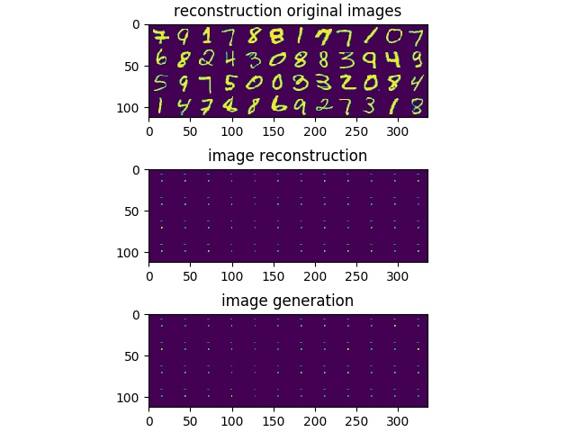

# Variational Auto Encoder
## About this Project
Here is a simple implementation of a VAE using tensorflow.

The parameters to be tuned can be accessed in params.py. Analysis below used these parameters.

The purpose of this repository is to learn and test an understanding of VAES. Please see the _VAE background_ section, this will get us an understanding of VAEs, which we can then test. See the _Analysis_ section for an analysis of the VAE.

## Requirements
Please pull my utils repo, and add it to your python path. The functions there are used.

The model is contained in main.py, the parameters are in params.py and the predictions folder contains saved images during training.

## VAE background
### Resources
These are great resources for VAEs:
- Original Paper: [Auto-Encoding Variational Bayes](https://arxiv.org/abs/1312.6114)
- Explanation: [Tutorial on Variational Autoencoders](https://arxiv.org/abs/1606.05908)

### Theory
#### What is a latent space?
This is the representation defined by the bottleneck layer of the network. This representation is called the latent representation, which is used to generate the observable data, X. 

The latent space is just the continuous set of all these latent representations.

#### How does VAEs construct a latent space?
Here is the problem: Train on a single point won't give good results for the points around that point. If we were to just deterministically backprop the difference (as is what happens with a normal autoencoder), we might not get good results when sampling the parts of the space that aren't training data representations.

To solve this, we should train a region around X for a given point X. Using the information in X to shape a region in space. Using many of these X will allow us to create our space. The region between two training points will be an interpolation between the two points. 

Another desireable of our space is if we can cause a small region in our space to generate the desired data, as we get further from this region, generation of X becomes more unlikely. This will allow us to use the information within the data efficiently.

How do we implement this solution? We will have our latent representation be a distribution instead of a deterministic point or a dirac delta. When training, we can update the parameters in this distribution.

How do we choose a distribution? The standard distribution to choose would be the normal distribution (this is what the paper uses). No matter what the image distribution is (for a given X), our encoder neural network should be able to map the distribution to a normal, (this is our prior). See Figure 2 in [Tutorial on Variational Autoencoders](https://arxiv.org/abs/1606.05908). We can represent the bottleneck layer as a distribution by calculating the mean and standard deviation. 

Prevent the distribution from collapsing to a point! Even if we set up our network to be able to represent a probabilistic latent representation, there is nothing preventing the network from setting the standard deviation to zero. Nothing in our objective accounts for the space between training samples. We need to constrain our latent representation distribution. This is where the KL divergence regularization term comes in. We will constrain it be close to our prior. We try to minimize the KL divergence between the prior (which is an isotropic normal) an our calculated distribution. By doing this we have also forced the images generated to be anchored to the same distribution/region of space (centered around 0), which is what we also desired.

### Implementation Tricks
reparameterization trick:
- What is it?
	- We won't be able to backprop through a random variable. This means that we won't be able to update the inference model, as our latent representation will be a random variable.
	- The reparameterization trick aims to solve this by separating the deterministic part and the random part. We can have mean and standard deviation be deterministic, where we can back propogate through, and have a noise term which get mulitplied to the standard deviation, which will cause this to be random.

- How to code it? We need to constrain our standard deviation to be positive, since our KL loss depends on that. We can either apply a softplus to the stddev, or we can allow it to be negative and say that the network is calculating the natural log of the stddev, which is what this project does. 

## Analysis:
### Loss Training
#### Cross Entropy 
The loss created from cross entropy is small, and gets overshadowed by the KLD loss. The result created is similar MSE loss. Shown below

Though the pure auto encoder approach is not as good for reconstruction as MSE.

#### MSE Reconstruction Loss
##### Normal Training
On it's own Mean Squared Error causes the Regularization loss to be come zero first, which overshadows the reconstruction loss. This causes the same image to be generated all the time, which looks like a accumlulation of all the numbers, since all of the numbers are constrained tightly to fit the normal distribution. 

For the KLD to be zero means that all reconstructions have the same embedding as a normal distribution, this means that the reconstruction will be a combination of all images.

The error contribution of MSE seems to be too low compared to the KLD error, which seems to be much easier to minimize, and overshadows the MSE Loss.

##### Slow KLD increase
Using weight from 0 to 1 for the KLD loss as training happens seems to help this issue. Though it remains to be seen how generation of new images is affected. (how the overall space is affected).

The picture above shows samples from the network after the KLD is slowly increased across 20000 steps. There is not much improvement, though we can see some other digits start to form, which means the MSE is starting to work. if we were to increae length of time of increase, we might get better results. Though, it seems that though the network is able to create reconstructions as an autoencoder, (MSE works on its own) the loss is hard to minimize compared to KLD loss.

The beginning of the training for the VAE with minimal KLD loss is shown above. The VAE is learning a deterministic representation for the training data, rather than a distribution over space, which is what we want.

#### AD Reconstruction Loss
##### Normal training
Similar to the MSE problem, the reconstruction seems to be even worse, though not really a concatenation of all images, it seems to take a more conservative approach, more of an average. The AD loss aims to decrease the penalty on perfect reconstruction of the image (pixels shifted right by a bit would be classified as incorrect, even though it is valid)

In this case, the KLD is becoming zero fast.

##### Slow KLD increase
The reconstruction and generation seem to be taking on a better form. The individual features of different numbers are starting to show up, but they all seem to have a common structure to the general digit representation. It seems that the KLD term is still too large. However, it seems that if we increase over a longer time period (I tested it across 20000 steps) we might get a better reconstructions. This will also be faster than MSE.

Though it is interesting to note that some reconstructions are very off from the original, and the ones that are off seem to default to the same number, a dim nine like digit. This digit is also the one that from the Normal training. Could this be a bias from the writer of the data? (Drawing thin, numbers.) The zeros are pretty consistent. It seems that the numbers that are in close proximity to the nine digit, collape/default to that representation.

#### Tuning the KLD Loss
We will use an isotropic normal as a prior for the KLD loss. There are two things that we can try, we can get the KL divergence of the 

### Architecture Tuning
- tuning the architecture (layer sizes, amounts)
- tuning latent representation size

### Analysis of the latent space:
- as the representation changes
- as the representation increases in size
- plot of space with umap/tsne
- Transformation between two reconstructions
- analysis of effect on latent space per sample
	- as a measure of distance.
- VAE space vs AE space
- how do the embeddings behave when a new label is introduced (eg. if we have a 1, and 7, what happens if we introduce a 8) How fast does the distributions realign themselves?

## Going Beyond 
Add in noise as part of the latent representation,
- Use a very small latent representation which is trained, rest is noise.

## Future Work
- add tensorboard
- celeba